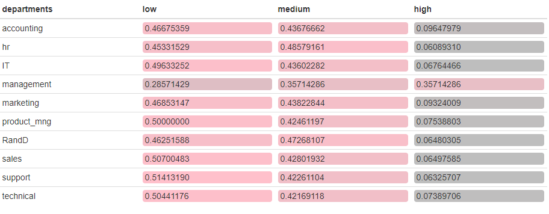

```{r setup, include=FALSE}
knitr::opts_chunk$set(echo = FALSE)
```
## Packages Employed

```{r, message=FALSE,warning=FALSE, echo=TRUE}
library(plyr)
library(scales)
library(tidyverse)
library(ggplot2)
library(ggcorrplot)
library(ggthemes)
library(formattable)
library(htmlwidgets)
library(ggalt)
library(party)
library(rpart)
library(rpart.plot)
library(pROC)

```
## Human Resources Data Set

[Human Resources Analytics Data](https://www.kaggle.com/ludobenistant/hr-analytics/data) from [kaggle](https://www.kaggle.com) with 14999x10 rows&columns
```{r, echo=FALSE,fig.align='center'}
d = read.csv("HR_comma_sep.csv")
#which(is.na.data.frame(d))
d <-d %>% rename("departments" = "sales") %>% tbl_df() %>% glimpse()
```

## Data Description

>- **satisfaction_level:** Job satisfaction level (0.0 - 1.0) 
>- **last_evaluation:** Last evaluation score (0.0 - 1.0)
>- **number_project:** Number of projects worked on (yearly basis)
>- **average_montly_hours:** Average monthly working hours 
>- **time_spend_company:** Time spent in the company (in years)
>- **Work_accident:** Whether they have had a work accident in the last 2 years (if yes 1, else 0)
>- **promotion_last_5years:** Whether they have had a promotion in the last 5 years 
>- **departments:** Name of the department
>- **salary:** Salary (low-medium-high)
>- **left:** Whether the employee has left (if yes 1, else 0) 

## Descriptive Statistics of the Numerical Features
```{r d, echo = FALSE,fig.align='center'}
d %>% select(-departments, -salary) %>% summary(d)
```
## Departmentwise Salary Frequencies

```{r, warning=FALSE, eval=FALSE }

d %>% count(departments, salary) %>%
  group_by(departments) %>%
mutate(
  salary = ordered(salary, c("low", "medium", "high")),n = percent(n, 0),
  n = n/sum(n)) %>% 
spread(salary, n) %>% 
formattable(list(area(T, 2:4) ~ color_tile("grey", "pink")), align = 'l')
```


## Histograms of the Numerical Variables
```{r, echo=FALSE, fig.align='center'}
multiplot <- function(..., plotlist = NULL, file, cols = 1, layout = NULL) {
  require(grid)

  plots <- c(list(...), plotlist)

  numPlots = length(plots)

  if (is.null(layout)) {
    layout <- matrix(seq(1, cols * ceiling(numPlots/cols)),
                 ncol = cols, nrow = ceiling(numPlots/cols))
}

if (numPlots == 1) {
print(plots[[1]])

} else {
grid.newpage()
pushViewport(viewport(layout = grid.layout(nrow(layout), ncol(layout))))

for (i in 1:numPlots) {
  matchidx <- as.data.frame(which(layout == i, arr.ind = TRUE))

  print(plots[[i]], vp = viewport(layout.pos.row = matchidx$row,
                                  layout.pos.col = matchidx$col))
 }
}
 }

p1 <- ggplot(subset(d ), aes(x=satisfaction_level, colour=satisfaction_level)) +
  theme_economist() + 
  scale_color_economist()+
  theme(plot.title = element_text(size=12)) +
  geom_histogram(binwidth = 0.05,color = 'black', fill = '#999999')  +
  ggtitle("Satisfaction Level") +
  labs(x="Job Satis. Score", y="Employee Count", size = 8)


p2 <- ggplot(subset(d ), aes(x=last_evaluation, colour=last_evaluation)) +
  theme_economist() + 
  scale_color_economist()+
  theme(plot.title = element_text(size=12)) +
  geom_histogram(binwidth = 0.05,color = 'black', fill = '#009E73') +
  ggtitle("Last Evaluation") +
  labs(x="Performance Score", y="Employee Count", size = 8)

p3 <- ggplot(subset(d ), aes(x=number_project, colour=number_project)) +
  theme_economist() + 
  scale_color_economist()+
  theme(plot.title = element_text(size=12)) +
  geom_histogram(binwidth = 1,color = 'black', fill = '#56B4E9')  +
  ggtitle("Yearly Projects") +
  labs(x="Number of Projects", y="Employee Count", size = 8)

p4 <- ggplot(subset(d ), aes(x=average_montly_hours, colour=average_montly_hours)) +
  theme_economist() + 
  scale_color_economist()+
  theme(plot.title = element_text(size=12)) +
  geom_histogram(binwidth = 10,color = 'black', fill = '#E69F00')  +
  ggtitle("Average Monthly Hours")+
  labs(x="Monthly Hours", y="Employee Count", size = 8)
  

p5 <- ggplot(subset(d ), aes(x=time_spend_company, colour=time_spend_company)) +
  theme_economist() + 
  scale_color_economist()+
  theme(plot.title = element_text(size=12)) +
  geom_histogram(binwidth = 0.5,color = 'black', fill = '#F0E442')  +
  ggtitle("Time Spent in Company") +
  labs(x="Time (Years)", y="Employee Count", size = 8)

p6 <- ggplot(subset(d ), aes(x=Work_accident, colour=Work_accident)) +
  theme_economist() + 
  scale_color_economist()+
  theme(plot.title = element_text(size=12)) +
  geom_bar(color = 'black', fill = '#0072B2')+ ## +
  ggtitle("Work Accidents") +
  labs(x="Accident Count", y="Employee Count", size = 8) +
  scale_x_continuous(breaks = c(0,1,1))

p7 <- ggplot(subset(d ), aes(x=left, colour=left)) +
  theme_economist() + 
  scale_color_economist()+
  theme(plot.title = element_text(size=12)) +
  geom_bar(color = 'black', fill = '#D55E00') +
  ggtitle("Employees Left") +
  labs(x="Left Count", y="Employee Count", size = 8) +
  scale_x_continuous(breaks = c(0,1,1))


p8 <- ggplot(subset(d), aes(x=promotion_last_5years, colour=promotion_last_5years)) +
  theme_economist() + 
  scale_color_economist()+
  theme(plot.title = element_text(size=12)) +
  scale_x_continuous(breaks = c(0,1,1)) +
  geom_bar(color = 'black', fill = '#CC79A7') +
  ggtitle("Promotion in 5 Years") +
  labs(x="Promotion Count", y="Employee Count", size = 8) 


multiplot(p1,p2,p3,p4,p5,p6,p7,p8,cols=3)
```

## How Many Left from Which Department?

```{r, fig.align='center'}
p9 <- ggplot(d, aes(x=d$departments,fill=as.character(d$left)))+
      theme_economist() + 
      scale_color_economist()+
      theme(axis.text.x = element_text(angle = 90, hjust=0))+
      geom_bar() +
      labs(x="Departments", y="Employee Count", fill="Left or Not")

p10 <- ggplot(d, aes(x=d$salary,fill=as.character(d$left) ))+
       theme_economist() + 
       scale_color_economist()+
       theme(axis.text.x = element_text(angle = 90, hjust=0))+
       geom_bar() +
       labs(x="Salary", y ="Employee Count",fill="Left or Not")

multiplot(p9,p10,cols=2)
```

## Department Left Rate by Satisfaction & Salary

```{r, echo=FALSE, fig.align='center'}
depLeftSatis <- d %>% group_by(departments) %>% summarise(Total =n(),LeftCount = sum(left), Satisfaction = mean(satisfaction_level) ) %>% mutate(LeftRate = LeftCount/Total) 
                                                         
                

p11 <- ggplot(data = depLeftSatis, aes( x = reorder(departments, -LeftRate), y = LeftRate, fill = Satisfaction)) +
    theme_economist() + 
    scale_color_economist()+
    theme(axis.text.x = element_text(angle = 90, hjust=0.5))+
    geom_col()+labs(x= "Departments", y="Left Rate")

depLeftSatis2 <- d %>% group_by(departments,salary) %>% summarise(Total =n(),LeftCount = sum(left), Satisfaction = mean(satisfaction_level) ) %>% mutate(LeftRate = LeftCount/Total)

p12 <-ggplot(data = depLeftSatis2, aes( x = reorder(departments, -LeftRate), y = LeftRate, fill=salary)) +
      theme_economist() + 
      scale_color_economist()+
      theme(axis.text.x = element_text(angle = 90, hjust=0.5)) +
      geom_bar(stat="identity",position = "stack")+labs(x= "Departments", y="Left Rate")
multiplot(p11,p12,cols = 2)
```

## Satisfaction vs. Working Hours 
```{r,,warning=FALSE,fig.align='center',fig.height=5}
dLeft <- d %>% filter(left==1) %>% select(-left)
d$left <- factor(d$left, labels=c("Working", "Quitted"))
gg <- ggplot(d,aes(satisfaction_level,average_montly_hours)) +   theme_economist() + scale_color_economist()

gg <- gg +geom_point(aes(col=factor(d$left)))

gg + geom_encircle(data=subset(d, 
                               satisfaction_level>=0.05 & 
                                 satisfaction_level<0.12 & 
                                 average_montly_hours>240 & 
                                 average_montly_hours<=310), colour="blue",expand=0.05,spread=0.02,size=2) +
  geom_encircle(data=subset(d, 
                               satisfaction_level>=0.35 & 
                                 satisfaction_level<0.47 & 
                                 average_montly_hours>122 & 
                                 average_montly_hours<164), colour="blue", expand=0,spread=0.02,size=2) +
  geom_encircle(data=subset(d, 
                               satisfaction_level>=0.47 & 
                                 satisfaction_level<=1 & 
                                 average_montly_hours>129 & 
                                 average_montly_hours<279), colour="green", expand=0, spread=0.02,size=2) +
  geom_encircle(data=subset(d, 
                               satisfaction_level>=0.715 & 
                                 satisfaction_level<=0.9 & 
                                 average_montly_hours>215 & 
                                 average_montly_hours<278), colour="blue", expand=0, spread=0.02,size=2) +

  scale_x_continuous(breaks=seq(0.08, 1, 0.08), limits = c(0.08, 1)) + 
  scale_y_continuous(breaks=seq(100, 315, 30), limits = c(100, 315)) +
  labs(x="Satisfaction Level",y="Avg. Monthly Hours",col="Left Work") 

```

## Satisfaction vs. Time Spent

```{r, echo=FALSE,fig.align='center',fig.height=5}

gg <- ggplot(d,aes(satisfaction_level,time_spend_company))

gg <- gg + geom_point(aes(col=factor(d$left))) +  theme_economist() + scale_color_economist()

gg + geom_encircle(data=subset(d, 
                               satisfaction_level>=0.72 & 
                                 satisfaction_level<=0.92 & 
                                 time_spend_company>4 & 
                                 time_spend_company<6.02), colour="blue", expand=0.02,spread=0.02,size=2)+
  geom_encircle(data=subset(d, 
                               satisfaction_level>=0.36 & 
                                 satisfaction_level<=0.47 & 
                                 time_spend_company==3 ), colour="blue", expand=0.02,spread=0.02,size=2)+
  geom_encircle(data=subset(d, 
                               satisfaction_level>=0.08 & 
                                 satisfaction_level<=0.12 & 
                                 time_spend_company>=3 &
                                time_spend_company<=5), colour="blue", expand=0.02,spread=0.02,size=2)+

  scale_x_continuous(breaks=seq(0.08, 1, 0.08), limits = c(0.08, 1)) + 
  scale_y_continuous(breaks =  seq(0,10,by=2), limits = c(0,10))+
  labs(x="Satisfaction Level",y="Time Spend In Company (Years)",col="Left Work") 
```

## Group Characteristics

+ *Group 1:* Low satisfaction level, long working hours and leaves in medium term (3-5 years)
+ *Group 2:* Mediocre satisfaction level, short working hours and leaves early (around 3 years)
+ *Group 3:* High satisfaction level and high working hours and leaves late (5-6 years)

## Correlation Matrix

```{r,echo=FALSE,fig.align='center',fig.height=5}

CorrMat <- round(cor(dLeft[,0:7]),3)
ggcorrplot(CorrMat, hc.order = TRUE, 
           #type = "lower", 
           lab = TRUE, 
           lab_size = 3, 
           method="circle", 
           colors = c("tomato2", "white", "springgreen3"), 
           ggtheme=theme_economist)
```

## PCA: Biplot
```{r, echo=FALSE,fig.align='center', warning=FALSE,  error=FALSE, fig.height=5}
dLeft_pca <- dLeft  %>% mutate(salary_Num = ifelse(salary == "low", 0, ifelse(salary == "medium", 1, 2))) %>% select(-salary,-departments)
pca_w_scaling<-princomp(as.matrix(dLeft_pca[,1:8]),cor=TRUE)
#summary(pca_w_scaling,loadings=TRUE)
library(ggbiplot)
ggbiplot(pca_w_scaling, labels= dLeft$satisfaction_level) +theme_economist()+ scale_color_economist() 
```

## PCA: Cumulative Variance
```{r,echo=FALSE,fig.height=5,fig.align='center'}
ggplot(data.frame(pc=1:8,cum_var=c(0.4123323, 0.5755905, 0.7074989, 0.8332550,0.9502024,0.97166737,0.98797999,1.00000000)),aes(x=pc,y=cum_var)) + 
  theme_economist() +
  scale_color_economist() +
  geom_point() +
  geom_line() +
  labs(x="Principal Component Number",
       y="Cumulative Proportion")
```

## K-Means Clustering

```{r}

#Filter to get the data from left people only
dleft<- subset(d, left=='Quitted') 
dleft<- select(dleft,-left)


#apply k-means with 3 clusters and 30 iterations
set.seed(42)
dleft_Cluster <- kmeans(dleft[, 1:7], 3, nstart = 30)

dleft_Cluster$centers

```
## Cluster-Group Correspondence
+ Cluster 1: High satisfaction level, long working hours, leaves late (corresponds to Group 3)
+ Cluster 2: Low satisfaction level, very long working hours, leaves at medium term (corresponds to Group 1) 
+ Cluster 3: Medium satisfaction level, short working hours, leaves early (corresponds to Group 2)

## Decision Tree Analysis And Prediction
```{r}
set.seed(42)

d <- d %>% # read in the data
  select(left, departments, satisfaction_level, 
         last_evaluation, number_project, average_montly_hours,
         time_spend_company, promotion_last_5years, salary) %>%
  mutate(departments = factor(departments), 
         salary = factor(salary))

n <- nrow(d)
indices <- sample(n, n*0.7)
train_d <- d[indices, ]
test_d <- d[-indices, ]

rtree_fit <- rpart(left ~ ., data = train_d) 
rpart.plot(rtree_fit)

```
Secondary factor that determines the satisfied employees quit decision is **time spent in the company**. If someone is working in the same company between 4.5 - 6.5 years, they break their comfort zone and flee because they work for long hours (> 216 h monthly basis) even if their bosses are very happy with their work (evaluation score > 0.80). We belive that this category corresponds to patient, hardworking, motivated employees of **Cluster 1** (i.e. Group 3).

## Conclusion

>- Satisfaction determines resignation. If low they quit!
>- People w/ VERY LOW satisfaction can work for VERY LONG working hours, ends the contract in medium terms.
>- People w/ MEDIOCRE satisfaction DO NOT work for long hours, resign quickly.
>- Patient, HIGHLY satisfied, hardworking workers quit latest.
>- Promotion and salary system must be improved for the good of the employees.

## References

- [Human Resources Analytics Data Set](https://www.kaggle.com/ludobenistant/hr-analytics/data)
- [Explore & Explain: Density & Decision Trees](https://www.kaggle.com/msjgriffiths/explore-explain-density-decision-trees)
- [Titanic: Getting Starting with R - Part 3: Decision Trees](http://trevorstephens.com/kaggle-titanic-tutorial/r-part-3-decision-trees/)
- [Intro to Decision Trees with R Example](https://rpubs.com/osazuwa/123908)
- [StackExchange](https://stats.stackexchange.com/questions/2038/interpretation-of-biplots-in-principal-components-analysis)
